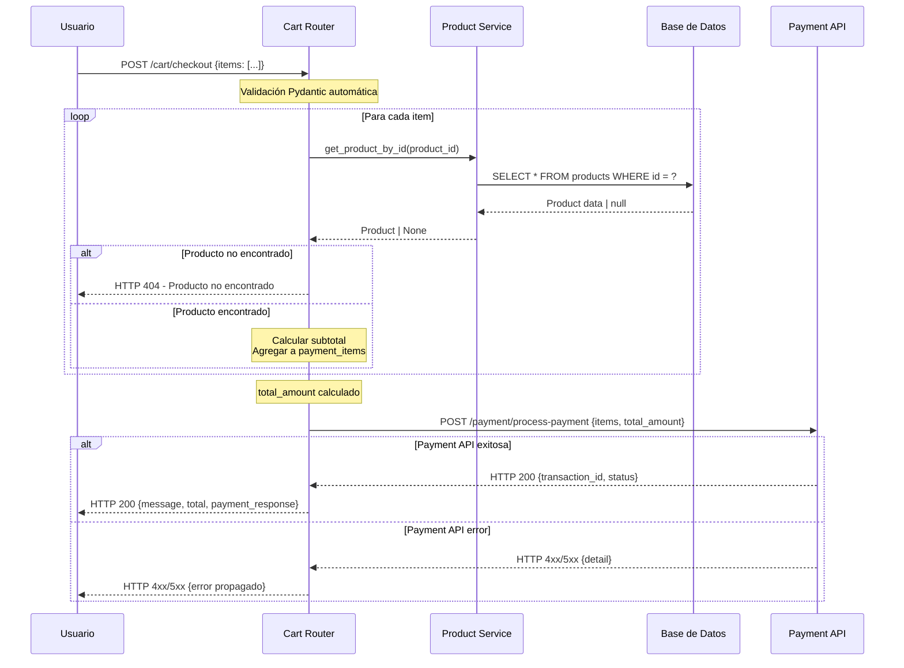
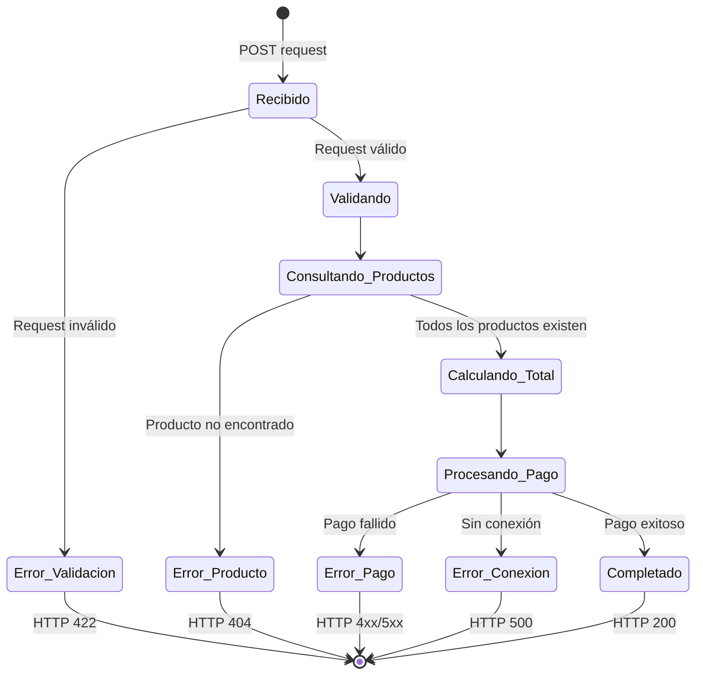

# Diagrama de Flujo: Checkout Process

```mermaid
flowchart TD
    A[Usuario envía POST /cart/checkout] --> B{Validar estructura request}
    B -->|Invalid| C[HTTP 422 - Validation Error]
    B -->|Valid| D[Inicializar total_amount = 0<br/>payment_items = []]
    
    D --> E[Para cada item en request.items]
    E --> F[Consultar producto en DB<br/>product_service.get_product_by_id]
    F --> G{¿Producto existe?}
    G -->|No| H[HTTP 404 - Producto no encontrado]
    G -->|Sí| I[Calcular subtotal<br/>total_amount += product.precio * quantity]
    
    I --> J[Agregar item a payment_items]
    J --> K{¿Más items?}
    K -->|Sí| E
    K -->|No| L[Construir payload para API pagos]
    
    L --> M[POST http://localhost:8000/payment/process-payment]
    M --> N{¿Conexión exitosa?}
    N -->|No| O[HTTP 500 - Connection Error]
    N -->|Sí| P{¿response.status_code == 200?}
    
    P -->|No| Q[HTTP response.status_code<br/>Propagar error de API pagos]
    P -->|Sí| R[Construir respuesta exitosa<br/>con transaction_id]
    R --> S[HTTP 200 - Checkout exitoso]
    
    style A fill:#e1f5fe
    style S fill:#c8e6c9
    style C fill:#ffcdd2
    style H fill:#ffcdd2
    style O fill:#ffcdd2
    style Q fill:#ffcdd2
```

# Diagrama de Secuencia: Interacciones del Sistema



# Estados del Carrito



# Arquitectura de Componentes

```
┌─────────────────────────────────────────────────────────────┐
│                     Cart Router                             │
├─────────────────────────────────────────────────────────────┤
│  ┌─────────────┐  ┌─────────────┐  ┌─────────────┐         │
│  │ CartItem    │  │ CheckoutReq │  │ Response    │         │
│  │ Model       │  │ Model       │  │ Model       │         │
│  └─────────────┘  └─────────────┘  └─────────────┘         │
└─────────────────────────────────────────────────────────────┘
                            │
        ┌───────────────────┼───────────────────┐
        │                   │                   │
        ▼                   ▼                   ▼
┌──────────────┐    ┌──────────────┐    ┌──────────────┐
│   Product    │    │   Payment    │    │   Database   │
│   Service    │    │     API      │    │   Session    │
│              │    │              │    │              │
│ - get_prod   │    │ - process    │    │ - get_db()   │
│   _by_id()   │    │   _payment   │    │              │
└──────────────┘    └──────────────┘    └──────────────┘
        │                   │                   │
        ▼                   ▼                   ▼
┌──────────────┐    ┌──────────────┐    ┌──────────────┐
│  Products    │    │   External   │    │  PostgreSQL  │
│  Database    │    │   Payment    │    │  Database    │
│              │    │   Gateway    │    │              │
└──────────────┘    └──────────────┘    └──────────────┘
```

# Matriz de Responsabilidades

| Componente | Responsabilidad | Input | Output |
|------------|----------------|-------|--------|
| **Cart Router** | Orquestación del checkout | CheckoutRequest | CheckoutResponse / HTTPException |
| **CartItem Model** | Validación de item individual | product_id, quantity | Validated CartItem |
| **CheckoutRequest Model** | Validación de request completo | List[CartItem] | Validated request |
| **Product Service** | Consulta de productos | product_id | Product / None |
| **Payment API** | Procesamiento de pagos | payment_payload | payment_response |
| **Database Session** | Acceso a datos | SQL queries | Database records |

# Patrones de Diseño Aplicados

## 1. Dependency Injection
```python
def checkout(request: CheckoutRequest, db: Session = Depends(get_db)):
    # db session inyectada automáticamente
```

## 2. Repository Pattern
```python
product_service = ProductServiceImpl(db)  # Service wraps repository
product = product_service.get_product_by_id(item.product_id)
```

## 3. DTO (Data Transfer Object)
```python
class CartItem(BaseModel):      # DTO para item individual
class CheckoutRequest(BaseModel): # DTO para request completo
```

## 4. Service Layer
```python
# Business logic encapsulada en el router
total_amount += product.precio * item.quantity
```

## 5. Error Propagation
```python
# Errores se propagan con contexto específico
raise HTTPException(
    status_code=response.status_code,
    detail=response.json().get("detail", "Error genérico")
)
```
